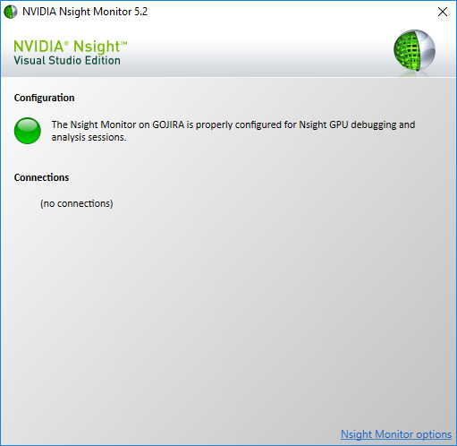
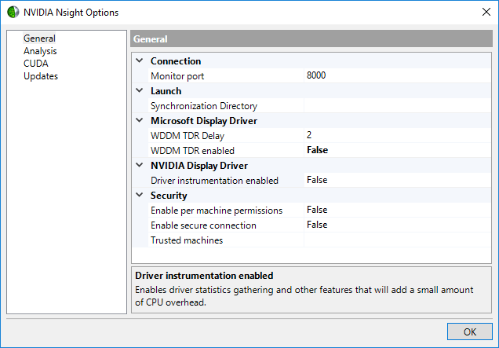

# KiloSort integration in JRCLUST

[KiloSort](https://github.com/cortex-lab/KiloSort) is a well-known software package for spike sorting using a template-matching framework.
JRCLUST integrates KiloSort in the following two ways:

## Running KiloSort from within JRCLUST

Given the [usual input files](https://github.com/JaneliaSciComp/JRCLUST/wiki/Input-and-output-files) that JRCLUST accepts, invoke JRCLUST in the following way:

```octave
jrc kilosort /path/to/prm/file
```

or

```octave
jrc ksort /path/to/prm/file
```

This will run the standard KiloSort suite of [`preprocessData`](https://github.com/cortex-lab/KiloSort/blob/master/preprocessData.m), [`fitTemplates`](https://github.com/cortex-lab/KiloSort/blob/master/fitTemplates.m), and [`fullMPMU`](https://github.com/cortex-lab/KiloSort/blob/master/fullMPMU.m).
If `fMerge_post` is set to 1, it will also run [`merge_posthoc2`](https://github.com/cortex-lab/KiloSort/blob/master/merge_posthoc2.m).
Additionally, if `fSave_phy` is set to 1, results will be saved in Phy-compatible format using [`rezToPhy`](https://github.com/cortex-lab/KiloSort/blob/master/finalPass/rezToPhy.m).

Normally when KiloSort is run, the result struct is saved in `rez.mat`.
When running KiloSort through JRCLUST, the result struct is saved (along with runtime and JRCLUST [parameter struct](https://github.com/JaneliaSciComp/JRCLUST/wiki/Parameters-struct-%28P%29)) in `${SESSION_NAME}_ksort.mat`, where `$SESSION_NAME` is the name of your `.prm` file (without the `.prm` extension).

JRCLUST then takes the output of this clustering and imports it, as detailed below.

## Importing a previous KiloSort session into JRCLUST

If you have a KiloSort session you would prefer to view in the JRCLUST GUI, you can instead import it via

```octave
jrc import-kilosort /path/to/prm/file
```

or

```octave
jrc import-ksort /path/to/prm/file
```

Note that you still need to construct a JRCLUST [parameter file and probe file](https://github.com/JaneliaSciComp/JRCLUST/wiki/Input-and-output-files) for this data set.
In general, as long as you point the parameter file at the correct probe file, you can change or keep the defaults as it suits your purposes.
(Your mileage may vary.)
If you're pointing JRCLUST at a KiloSort session that you did **not** sort through JRCLUST, it expects the `rez.mat` file from that session.
Unfortunately, the `.npy` files generated by `rezToPhy` don't contain all the data needed for JRCLUST.

If you set `fMerge_post` to 0, the KiloSort cluster IDs will be identical with the template IDs.
Otherwise, they will not be the same in general -- in particular, some clusters may be merged into others and the number of clusters may be less than the number of templates.
In this case, JRCLUST consolidates cluster IDs so that they are numbered 1, 2, ..., `nclusters`, rather than leaving gaps in the cluster labels.
We save the original labels in `S_clu.viClu_old` for comparison with KiloSort's output.

Because the JRCLUST GUI is coupled to the clustering algorithm, we extract features and compute rho and delta values for each event detected by KiloSort (which features you decide to use for this is up to you and can be set in the parameter file).
This does *not* alter the cluster labels given by KiloSort, but you might use these values to perform your own clustering of events detected by KiloSort.

## Gotchas

### CUDA_ERROR_LAUNCH_FAILED

On Windows, you might get the following error (or similar) during the rho-delta step:

```
Error using gpuArray/gather
An unexpected error occurred during CUDA execution.
The CUDA error was:CUDA_ERROR_LAUNCH_FAILED
```

(Here's some background on what's going on: [Timeout Detection and Recovery (TDR) | Microsoft Docs](https://docs.microsoft.com/en-us/windows-hardware/drivers/display/timeout-detection-and-recovery))

To fix this, open up the NVIDIA Nsight Monitor **as administrator**.
You should see a screen similar to below:



Click on **Nsight Monitor options** in the lower right corner.
You'll see the following screen:



Set **WDDM TDR enabled** to **False**, click **OK**, and reboot.